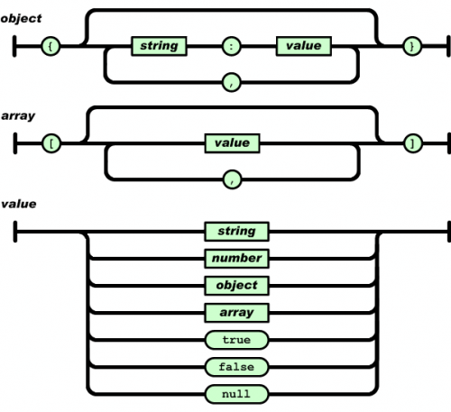

## 702 Local Storage
2017.04.01 [HTML, CSS, JS]

# Working with JSON using Javascript (No JQuery)

JSON (JavaScript Object Notation) is a lightweight data-interchange format. It is easy for humans to read and write. It is easy for machines to parse and generate. It is based on a subset of the JavaScript Programming Language, Standard ECMA-262 3rd Edition - December 1999. JSON is a text format that is completely language independent.

Reference <http://json.org>, <https://jsonlint.com>

In JSON, they take on these forms:

An object is an unordered set of name/value pairs. An object begins with { (left brace) and ends with } (right brace). Each name is followed by : (colon) and the name/value pairs are separated by , (comma).

An array is an ordered collection of values. An array begins with left bracket [ ] right bracket. Values are separated by , (comma).



A value can be a string in double quotes, or a number, or true or false or null, or an **object** or an **array**. These structures can be nested.

## JSON Track/Training (JTT) Format

Reference <https://github.com/dret/JTT>

```bash
{ "JTT" : [
    { "track" : {
        "title" : "Test",
        "desc" : "Simple test activity",
        "segments" : [
            { "data-fields" : ["latitude", "longitude", "elevation", "temperature", "HR" ] },
            [
            [ 47.407, 8.553, 451.72, "2015-11-13T12:57:24.000Z", 28.0, 76],
            [ 47.4076, 8.5531, 451.01, "2015-11-13T12:57:25.000Z", 28.0, 76],
            ...
            ]
        ]}
    }
]}
```

GPX Mapping:

latitude -> lat
longitude -> lon
elevation -> ele
time -> time
temperature -> temperature
HR -> hr

## GPX Format:

```xml
<?xml version="1.0" encoding="UTF-8"?>
<gpx version="1.1">
  <trk>
    <name>Track Name</name>
    <time>2012-10-24T23:00:00.000Z</time>
    <trkseg>
      <trkpt lon="-77.02016168273985" lat="38.92747367732227">
        <ele>25.600000381469727</ele>
        <time>2012-10-24T23:29:40.000Z</time>
      </trkpt>
      <trkpt ...></trkpt>
    </trkseg>
  <trk>
</gpx>
```

## GeoJSON Format

## Local Storage

The storing a object in "Local Storage" will not really give the object back. This is because, when it evaluate the object, it will return the string “[object Object]”.

To save record in "Local Storage" javascript object need to be JSON.stringify. However JSoN is not supported in all browser.

To read record store in "Local Storage", JSON needs to converted back wiht JSON.parse(localStorage.getItem("x")) to Javascipt object for manipulation.

To see the list browsers that support JSON. <http://caniuse.com/#search=JSON>

```example
if (localStorage) {
  // LocalStorage is supported!
} else {
  // No support. Use a fallback such as browser cookies or store on the server.
}
```
